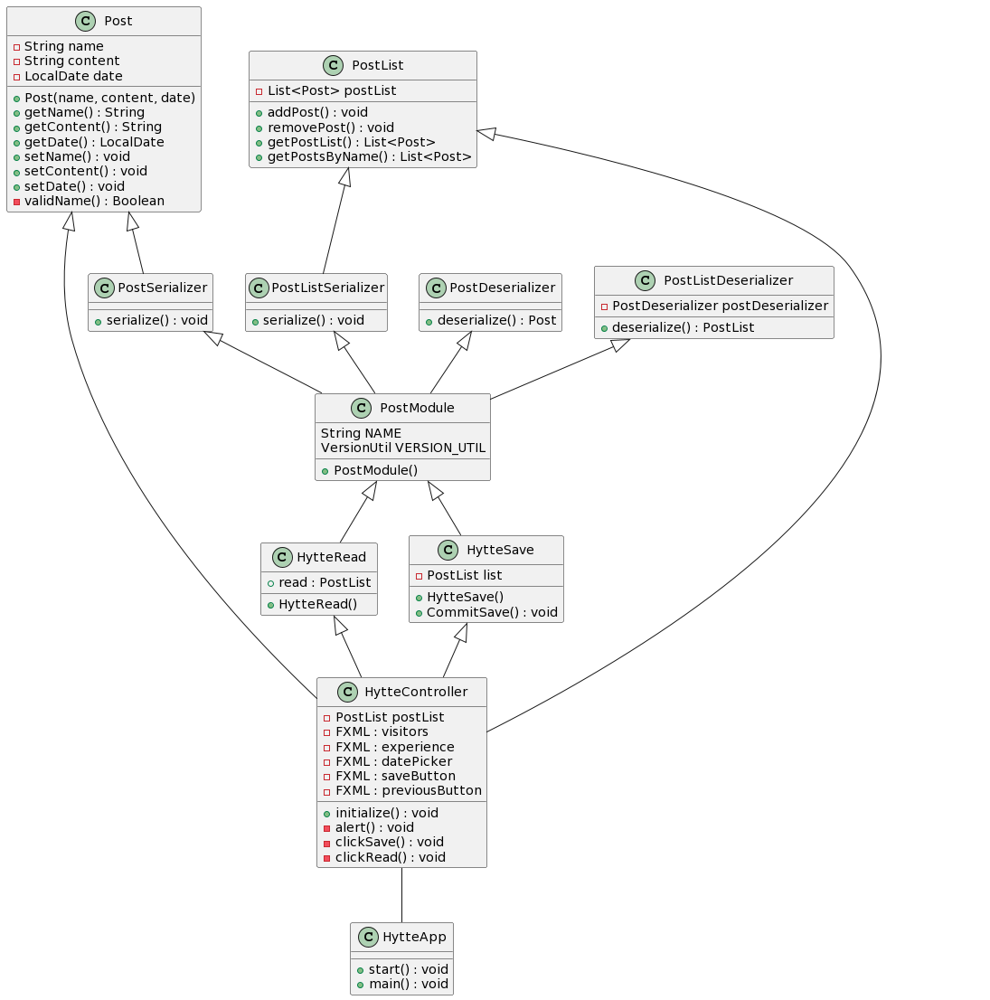

## Hyttebok - Release2 dokumentasjon

Det har blitt gjort relativt store endringer i prosjektet, selv om selve funksjonaliteten til applikasjonen ikke er utvidet noe særlig.
Link til Milestone 2 i gitlab:
https://gitlab.stud.idi.ntnu.no/it1901/groups-2022/gr2208/gr2208/-/milestones/2#tab-issues

### Modularisering

Vi har delt prosjektet inn i to hovedmoduler, _core_ og _fxui_.
_Core_ inneholder kjernelogikken til prosjektet.
_Fxui_ inneholder brukergrensesnitt, samt controller- app- og lagringsklasser.

Parent-pom.xml ligger i _hytte_.
Begge modulene har hver sin pom.xml-fil som definerer hvilke maven-plugins som skal brukes.

### Arkitektur

Kjernelogikken, ui-et og persistensen er skilt fra hverandre i passende klasser. Svært lite logikk ligger i kontroller-klasse _HytteController_.

For persistens brukes JSON, med Jackson.
Hovedklassene for lesing og lagring til fil finnes i fxui-modulen i _hytte_ --> _fxui_ --> _src_ --> _main_ --> _java_ --> _hytte_ --> _ui_.  
Støtteklassene for Jackson-bruk ligger i _hytte_ --> _core_ --> _src_ --> _main_ --> _java_ --> _hytte_ --> _json_

Applikasjonen vår bruker implisitt lagring, ettersom tidligere innlegg i hytteboka skal hentes automatisk når programmet åpnes.

### Kodekvalitet og testing

Alle modulene testes.
Testdekningsgraden blir fortsatt rapportert med Jacoco.
Prosjektet bruker nå også pluginsene Checkstyle og Spotbugs, og vi har ryddet opp i koden tilsvarende deres tilbakemeldinger. Konfigurasjonsfilene til disse ligger i _hytte_ --> _config_.

### Klasser

Prosjektet har som nevnt fått flere nye klasser, som brukes for lesing og skriving til fil.

Klassediagram på nåværende tidspunkt:

### Valg knyttet til arbeidsvaner, arbeidsflyt og kodekvalitet

#### Arbeidsvaner og arbeidsflyt

Vi har hatt minst ett møte i uka, der vi jobber sammen og fordeler arbeidsoppgaver. Dette har fungert bra, og vi sikter på å fortsette med dette ut prosjektet.

Vi har fortsatt å ta i bruk issues, brancher og milestones i gitlab.
I tillegg har vi begynt å ta i bruk merge requests for branchene, og forsøker å vende oss til å tagge relevante issues i commit-meldinger. Spesielt issue-tagging merker vi gir bedre oversikt over prosjektets utvikling i gitlab.

#### Kodekvalitet

Vi har valgt å bruke de foreslåtte testverktøyene Checkstyle, Spotbugs og Jacoco.

Noen av modulene i Checkstyle har vi skrudd av, ettersom vi konkluderte med at de gjorde koden mer uryddig, og dermed virket mot sin hensikt. 
For eksempel var det en modul som klagde hvis et parameter til en konstruktør hadde samme navn som en av klassens attributter. Dette vurderte vi som unødvendige og uoversiktlige endringer.

Spotbugs har vi ikke endret innstillingene til enda. Vi har likevel opprettet en exclude.xml konfigurasjonsfil for å lett kunne endre senere.