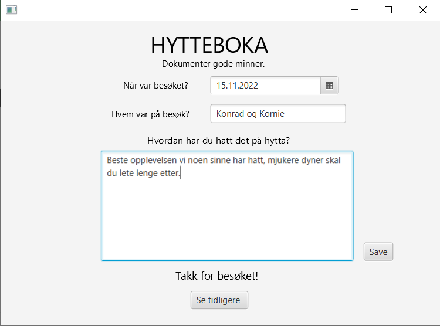
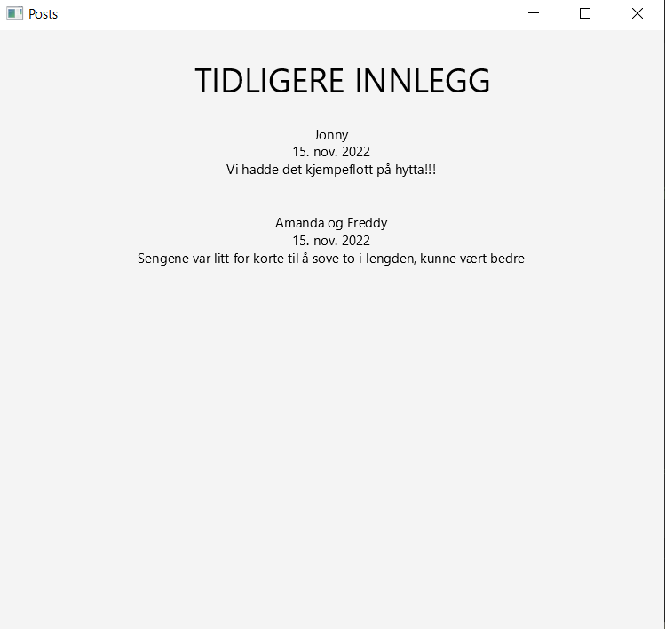
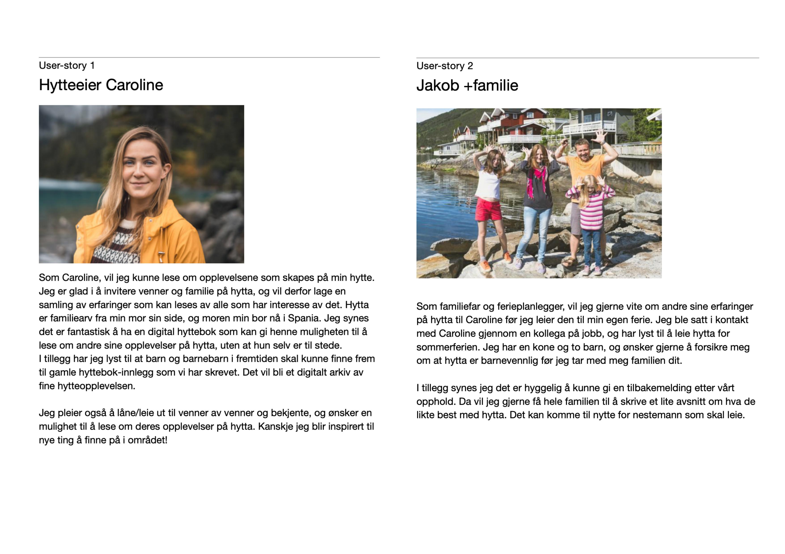
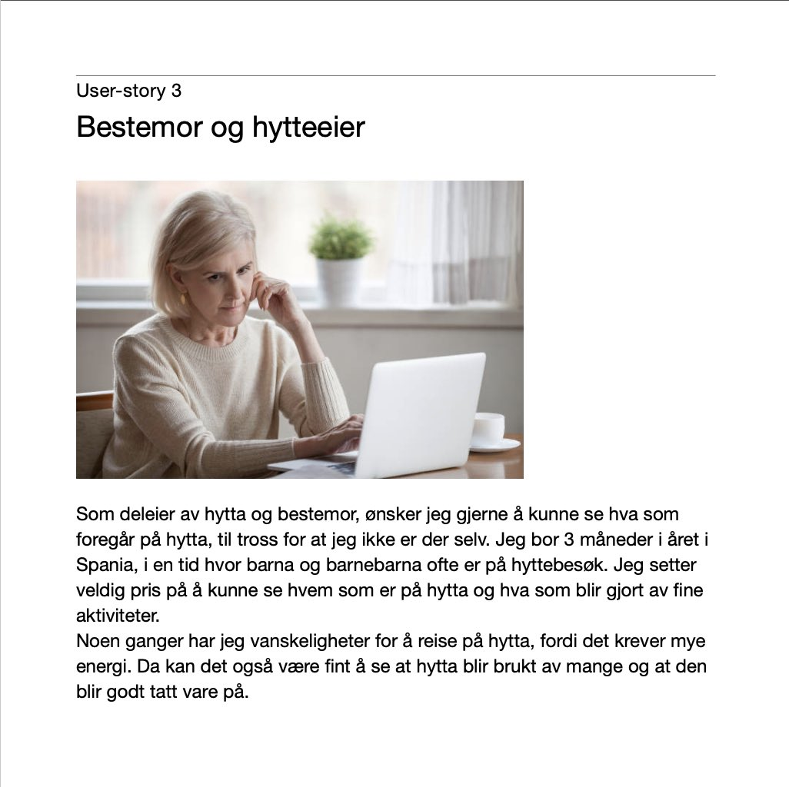

## Beskrivelse av hytteboka

Prosjektet vårt går ut på at vi skal lage en digital hyttebok. I hytteboka skal besøkende kunne fortelle om hvordan de syns hytteturen har vært. Dette vil fungere ved at de legger inn ett navn, en dato og skriver en oppsummering av turen som vil publiseres til boka. Hver loggføringen vil bli lagret med navnet, datoen og innlegget, i en liste med alle loggføringene.

Her er et illustrerende skjermbilde for hvordan appen skal fylles inn.

Brukeren har mulighet til å lese de tidligere innleggene, ved å trykke på en knapp på forsiden av applikasjonen, som heter "Se tidligere". Her vil man kunne lese og mimre over gamle hendelser på hytta.

Her er et illustrerende bilde av denne siden.

 

## Brukstilfeller

Vi har lagd tre brukercaser som tar for seg hvorfor man kunne tenke seg å ha en digital hyttebok. Case 1 er fra hytteier sitt perspektiv og case 2 er fra perspektivet til noen bekjente som leier hytta.

I tillegg har vi laget en tredje case for utvidelsen av funksjonaliteten. Denne casen er bestemor som vil lese innlegg fra utlandet.

