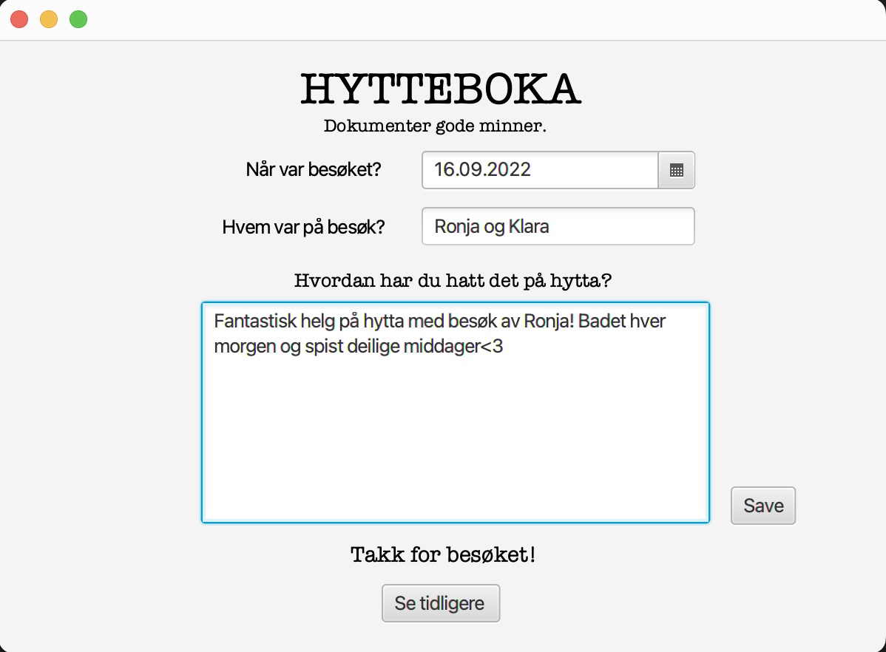
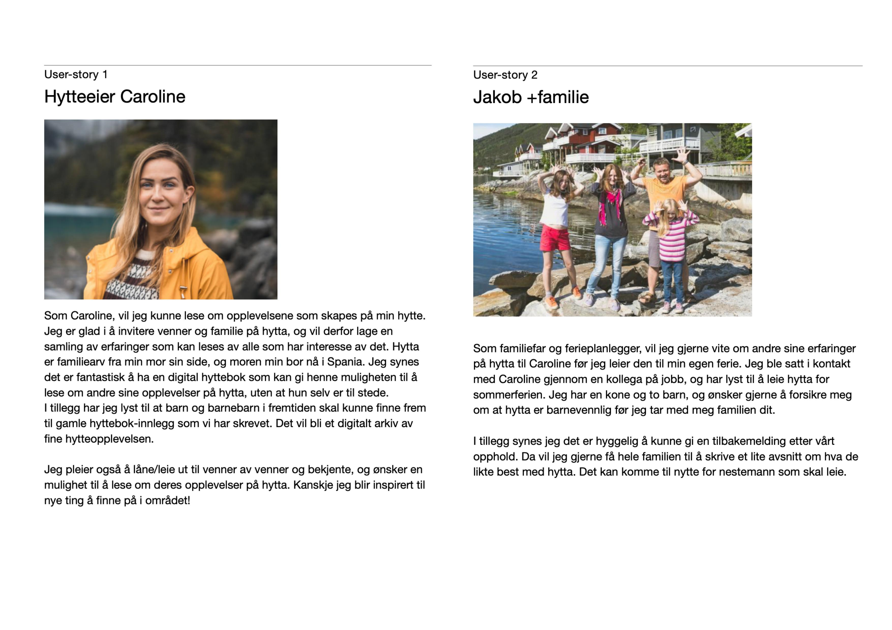

**Beskrivelse av hytteboka**

Prosjektet vårt går ut på at vi skal lage en digital hyttebok. I hytteboka skal besøkende kunne fortelle om hvordan de syns hytteturen har vært. Dette vil fungere ved at de legger inn ett navn, en dato og skriver en oppsummering av turen som vil publiseres til boka. Loggføringen vil bli koblet opp med navnet og datoen, vi tenker dette kan være nyttig hvis vi vil utvide applikasjonen sånn at man kan finne gamle innlegg basert på dato eller navn. Dette er derimot ikke den viktigste funksjonaliteten til applikasjonen, og ikke høyest prioritet. Det er viktigere å kunne få opp gamle loggføringer fra boka, slik at man kan lese og mimre over gamle hendelser på hytta.

Her er et illustrerende skjermbilde for hvordan appen skal fylles inn.

 
 
 

**Brukercase**

Vi har lagd to brukercaser som tar for seg hvorfor man kunne tenke seg å ha en digital hyttebok i stede for en fysisk. Case 1 er fra hytteier sitt perspektiv og case 2 er fra noen som leier hytta sitt perspektiv.

